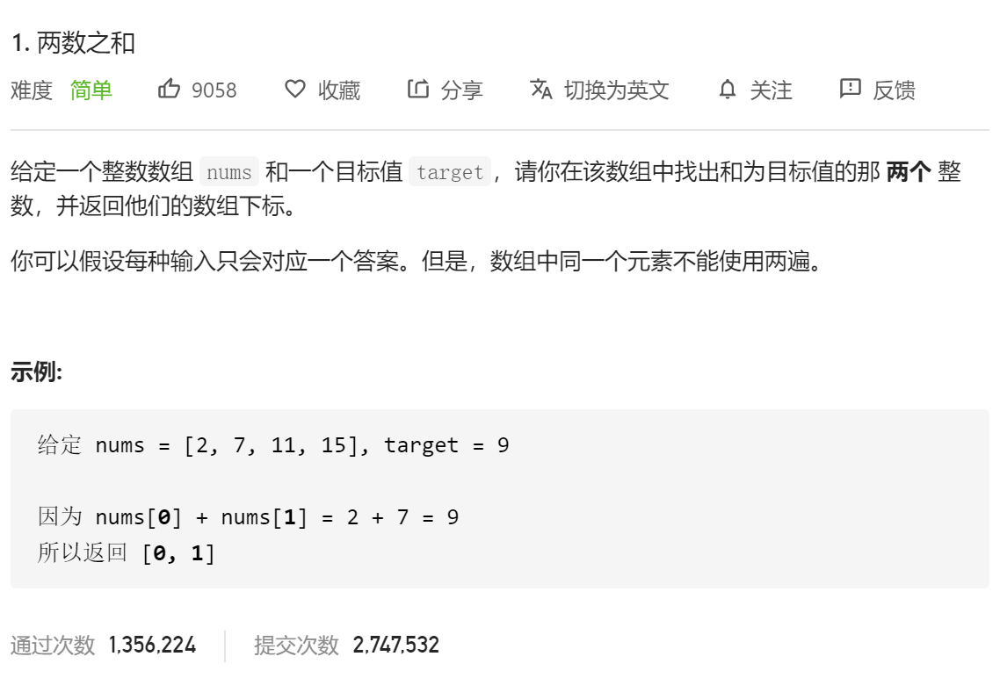

# 方法一：暴力求解

```python
class Solution(object):
    def twoSum(self, nums, target):
        """
        :type nums: List[int]
        :type target: int
        :rtype: List[int]
        """
        for i in range(len(nums)-1):
            for j in range(i+1,len(nums)):
                if nums[i]+nums[j]==target:
                    return [i,j]
        return []
```

**时间复杂度**：O(n^2)

**空间复杂度**：O(1)

# 方法二：两遍哈希

**哈希表的设计即是用空间换时间**

```python
class Solution(object):
    def twoSum(self, nums, target):
        """
        :type nums: List[int]
        :type target: int
        :rtype: List[int]
        """
        hashmap = {}
        for i in range(len(nums)):
            hashmap[nums[i]] = i
            
        for i in range(len(nums)):
            #获取差值
            cur = target-nums[i]
            if cur in hashmap and hashmap[cur]!=i:
                return [i,hashmap[cur]]
            
        return []
```

**时间复杂度**：O(n)

**空间复杂度**：O(n)

# 方法三：一遍哈希

可以将两遍哈希过程转成一遍哈希

```python
class Solution(object):
    def twoSum(self, nums, target):
        """
        :type nums: List[int]
        :type target: int
        :rtype: List[int]
        """
        hashmap = {}
        for index,item in enumerate(nums):
            #如果差值在哈希表中
            if target-item in hashmap:
                return [hashmap[target-item],index]
            #如果不在就把当前值和索引入哈希表
            else:
                hashmap[item] = index
        return []
```

**时间复杂度**：O(n)

**空间复杂度**：O(n)