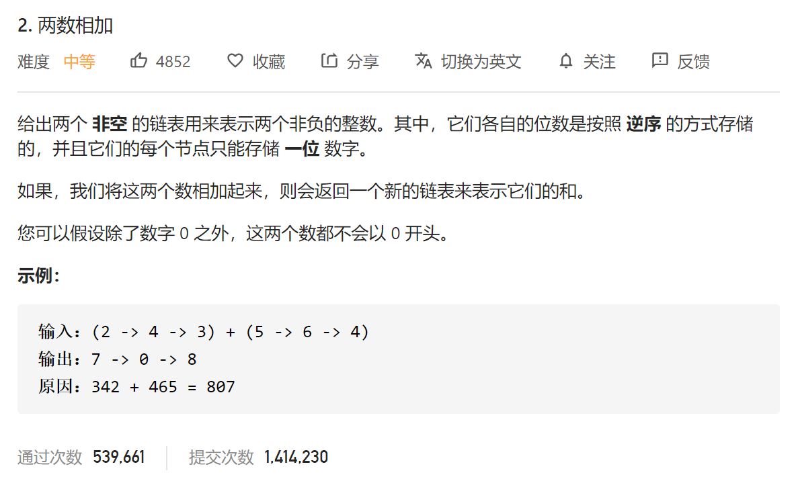

直接模拟链表计算过程

```python
# Definition for singly-linked list.
# class ListNode(object):
#     def __init__(self, x):
#         self.val = x
#         self.next = None

class Solution(object):
    def addTwoNumbers(self, l1, l2):
        """
        :type l1: ListNode
        :type l2: ListNode
        :rtype: ListNode
        """
        dummy = ListNode(0)
        p = dummy
        carry = 0
        cur = 0
        while l1 or l2:
            cur = carry
            if l1:
                cur += l1.val
                l1 = l1.next

            if l2:
                cur+=l2.val
                l2 = l2.next

            carry = cur // 10
            cur = cur % 10
            
            p.next = ListNode(cur)
            p = p.next

        if carry ==1:
            p.next = ListNode(1)

        return dummy.next
```

