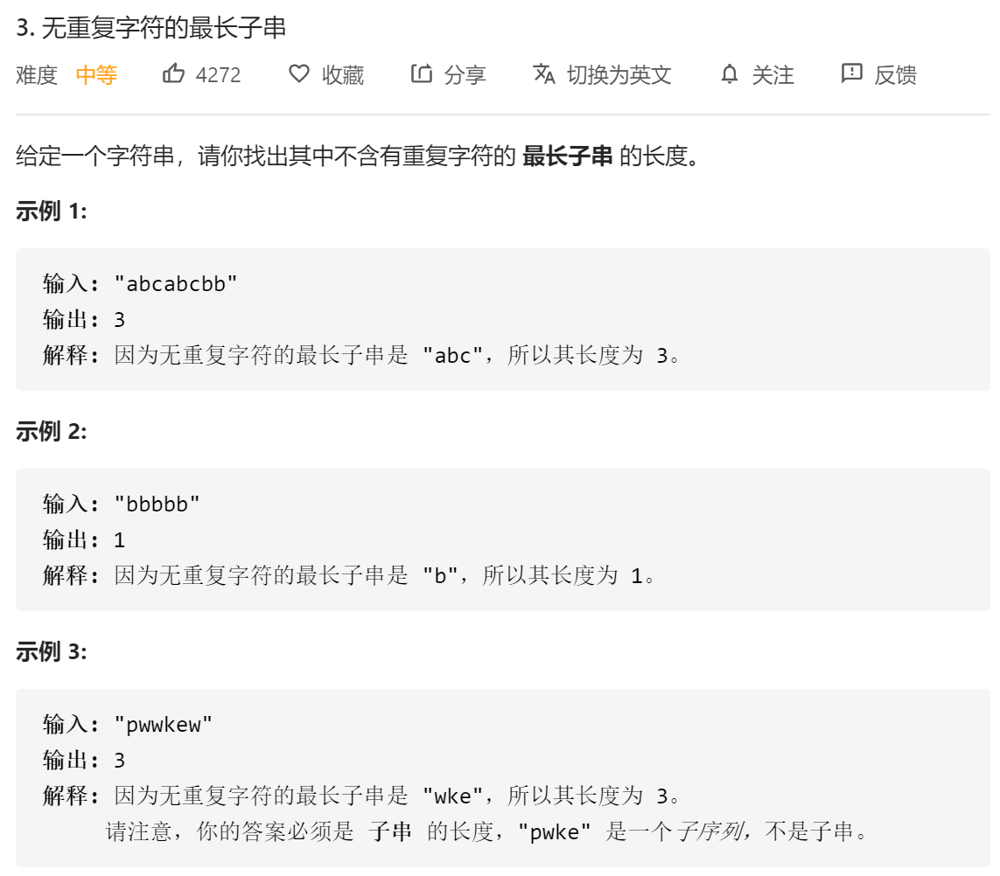

# 方法一：滑动窗口

$$
以 \texttt{(a)bcabcbb}(a)bcabcbb 开始的最长字符串为 \texttt{(abc)abcbb}(abc)abcbb；\\
以 \texttt{a(b)cabcbb}a(b)cabcbb 开始的最长字符串为 \texttt{a(bca)bcbb}a(bca)bcbb；\\
以 \texttt{ab(c)abcbb}ab(c)abcbb 开始的最长字符串为 \texttt{ab(cab)cbb}ab(cab)cbb；\\
以 \texttt{abc(a)bcbb}abc(a)bcbb 开始的最长字符串为 \texttt{abc(abc)bb}abc(abc)bb；\\
以 \texttt{abca(b)cbb}abca(b)cbb 开始的最长字符串为 \texttt{abca(bc)bb}abca(bc)bb；\\
以 \texttt{abcab(c)bb}abcab(c)bb 开始的最长字符串为 \texttt{abcab(cb)b}abcab(cb)b；\\
以 \texttt{abcabc(b)b}abcabc(b)b 开始的最长字符串为 \texttt{abcabc(b)b}abcabc(b)b；\\
以 \texttt{abcabcb(b)}abcabcb(b) 开始的最长字符串为 \texttt{abcabcb(b)}abcabcb(b)。\\
$$

从上例可以看出，发现了什么？如果我们依次递增地枚举子串的起始位置，那么子串的结束位置也是递增的！这里的原因在于，假设我们选择字符串中的第 k个字符作为起始位置，并且得到了不包含重复字符的最长子串的结束位置为 r_k。那么当我们选择第 k+1个字符作为起始位置时，k+1到r_k 的字符显然是不重复的，并且由于少了原本的第 k个字符，我们可以尝试继续增大 r_k，直到右侧出现了重复字符为止。

**其中有个判断重复的过程，可以使用哈希集合来判重**

```Python
class Solution(object):
    def lengthOfLongestSubstring(self, s):
        """
        :type s: str
        :rtype: int
        """
        #哈希集合
        occ = set()
        n = len(s)
        
        #右指针从-1开始，还没有开始移动
        rk,ans = -1,0
        for i in range(n):
            if i!=0:
                #如果i不为0，就左指针右移一格，移除一个字符
                occ.remove(s[i-1])
            while rk+1<n and s[rk+1] not in occ:
                #不断右移指针
                occ.add(s[rk+1])
                rk+=1
           	ans = max(ans,rk-i+1)
            
        return ans
```


# 滑动窗口万能模板

```python
class Solution:
    def lengthOfLongestSubstring(self, s):
        """
        :type s: str
        :rtype: int
        """
        from collections import defaultdict
        #窗口
        lookup = defaultdict(int)
        
        #左指针
        start = 0
        
        #右指针
        end = 0
        
        #最大长度
        max_len = 0
        
        #计数器，用来记录字符重复个数
        counter = 0
        
        while end < len(s):
            #如果出现过
            if lookup[s[end]] > 0:
                counter += 1
            lookup[s[end]] += 1
            end += 1
            
            #counter大于0，说明有重复字符，开始回溯，左指针往前走
            while counter > 0:
                #大于1的目的是保证只出现一次
                if lookup[s[start]] > 1:
                    counter -= 1
                lookup[s[start]] -= 1
                start += 1
            max_len = max(max_len, end - start)
        return max_len
```

