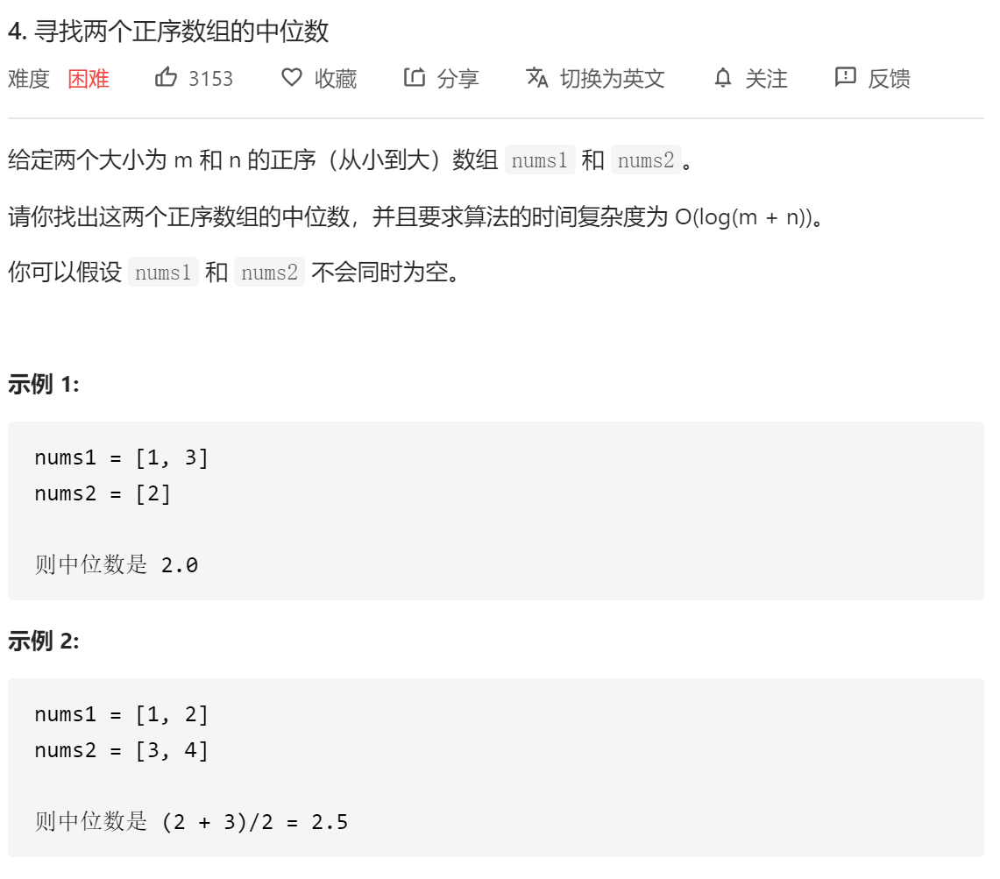

# 寻找两个正序数组的中位数



## 思路一

1. 首先理解中位数，指该数的两边元素个数相等，可以分别用两个指针指两个数组，比较元素大小，一共移动(m+n+1)/2次就好，时间复杂度：O(M+N)。

2. 比如

   ```python
   nums1: [a1,a2,a3,...,am]
   nums2: [b1,b2,b3,...,bn]
   
   [nums1[:left1],nums2[:left2] | nums1[left1:],nums2[left2:] # 只要保证左右两边个数相同，|表示中位数
   ```

   如何确定边界值，可以使用二分法

   可以先确定nums1取m1个数的左半边，那么nums2取m2 = (m+n+1)/2-m1的左半边，那么问题就是如何找到合适的m1，因此使用二分法查找。

   

   ```
   [[a1],[b1,b2,b3] | [a2,a3,am],[b4,b5,...,bn]]
   ```

   只要确定b3和a2的关系就能知道这样分是否准确。

3. 例子：

   ```
   nums1:[-1,1,3,5,7,9]
   nums2:[2,4,6,8,10,12,14,16]
   
   当m1 = 4，m2 = 3，中位数是median = (nums[m1]+nums2[m2]) / 2
   ```

   时间复杂度是：O(log(min(m,n)))

   ```python
   from collections import Counter
   
   class Solution(object):
       def findMedianSortedArrays(self, nums1, nums2):
           """
           :type nums1: List[int]
           :type nums2: List[int]
           :rtype: float
           """
           m = len(nums1)
           n = len(nums2)
   
           #保证元素个数小的数组在前
           if m>n:
               return self.findMedianSortedArrays(nums2,nums1)
           
           k = (m+n+1)//2
   
           left = 0
           right = m
   
           #二分查找m1的位置
           while left < right:
               m1 = left + (right-left)//2
               m2 = k-m1
   
               if nums1[m1]<nums2[m2-1]:
                   left= m1+1
               else:
                   right = m1
   
           m1 = left
           m2 = k-m1
   
           #找nums1[m1-1]和nums2[m2-1]的最大值
           c1 = max(nums1[m1-1] if m1>0 else float("-inf"),nums2[m2-1] if m2>0 else float("-inf"))
   
           #中位数是c1
           if (m+n) %2 ==1:
               return c1
   
           #找nums1[m1]和nums2[m2]的最小值
           c2 = min(nums1[m1] if m1<m else float("inf"),nums2[m2] if m2<n else float("inf"))
   
           #中位数是二者均值
           return (c1+c2)/2.0
   ```

   