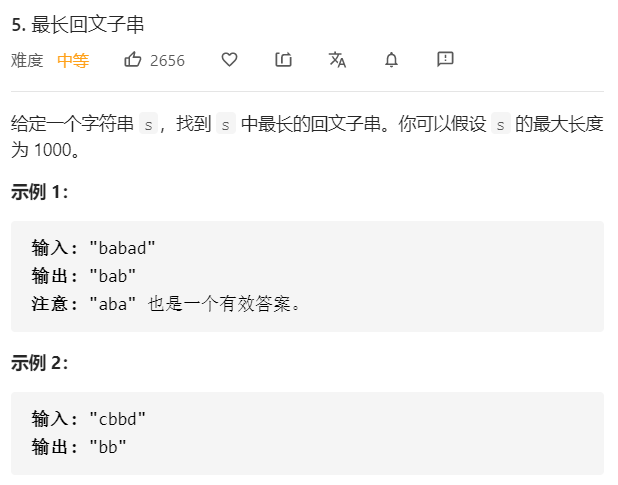

# 思路一：动态规划

对于一个回文串，去除首尾相同的字符，余下部分仍然是个回文串，因此可以考虑使用动态规划求解。

**定义状态**：用P(i,j)表示字符串s的第i到第j个字母组成的子串s[i:j]是否为回文串：
$$
P(i,j) = 
\begin{cases} 
	& True , s[i:j]是回文串 \\
	& False , s[i:j]不是回文串或i>j\\
\end{cases}
$$
**转移方程**：
$$
P(i,j) = P(i+1,j-1) \&\& (S_{i}==S_{j})
$$
也就是说只有s[i+1,j-1]是回文串，并且s的第i和j个字母相同，s[i:j]才是回文串

**边界条件**：

上面的讨论都是建立在s的长度大于2的情况，还要考虑s长度为1或2的情况
$$
\begin{cases} 
 & P(i,i)=True \\
 & P(i,i+1) = (S_{i}==S_{i+1}) \\
\end{cases}
$$

```python
class Solution:
    def longestPalindrome(self, s):
        size = len(s)
        if size < 2:
            return s

        dp = [[False for _ in range(size)] for _ in range(size)]

        max_len = 1
        start = 0

        for i in range(size):
            dp[i][i] = True

        for j in range(1, size):
            for i in range(0, j):
                if s[i] == s[j]:
                    if j - i < 3:
                        dp[i][j] = True
                    else:
                        dp[i][j] = dp[i + 1][j - 1]
                else:
                    dp[i][j] = False

                if dp[i][j]:
                    cur_len = j - i + 1
                    if cur_len > max_len:
                        max_len = cur_len
                        start = i
        return s[start:start + max_len] 
```

