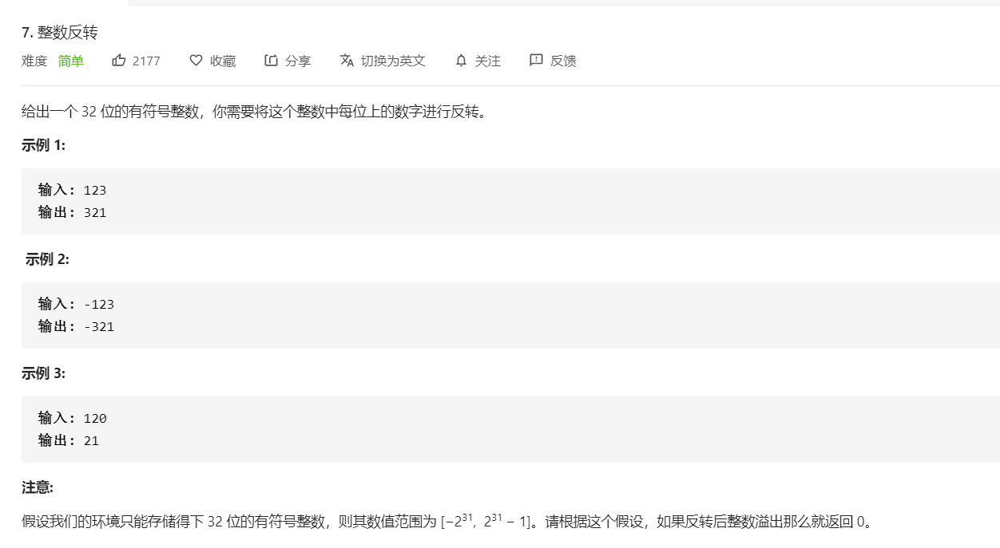

模拟过程

```python
class Solution(object):
    def reverse(self, x):
        """
        :type x: int
        :rtype: int
        """
        if x<0:
            flag = -1
        else:
            flag = 1

        x = abs(x)

        res = 0 

        while x:
            res = res*10 + x % 10
            x = x // 10

        res = flag*res
        res = 0 if res<-2**31 or res > 2**31-1 else res

        return res
```

